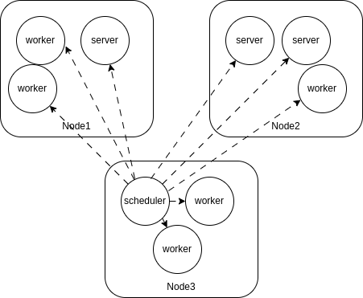

# 前言
ps-lite是一个分布式参数服务器,github地址为[ps-lite](https://github.com/dmlc/ps-lite)。该库通过几千行代码,实现了包含分布式节点管理,简单故障恢复,参数自定义分片的基于推送/拉取模式建议服务器。本文将自顶向下的对该项目进行分析,深入源码,了解具体实现原理并分析不足之处。  
# 集群拓普

  

ps-lite集群拓普结构
  

ps-lite的集群相对简单,由一个scheduler,任意个worker和server组成,支持在任意节点部署任意多个worker和server,并且相同节点的worker和server可以共享同一个端口。  
worker/server可以是独立的进程,也可以是同一个进程的不同线程,不同节点上的worker和server的数量也可以任意指定,因此比较好的支持了异构的分布式环境。  
该集群中只能存在一个scheduler,负责管理worker和server的注册，给每一个协作者分配一个唯一的id。同时scheduler也承担着一定程度的故障恢复能力，在故障节点重新上线/被替换后能够将新的节点信息广播给其他节点。确保集群具有一定的自我修复能力。  
ps-lite不支持协作者数量的动态增加和减少。虽然节点总数是确定的，但在某些节点异常时，可以通过在其他节点上重新启动一个新的节点来替换异常节点，从而实现动态加入/退出的效果。
在ps-lite的通信模型中，集群中的任意两个节点的通信不需要经过scheduler的转发。但由于通信方式的可拓展性，具体实现中也可以通过scheduler转发消息。
集群总体采用了Push/Pull的通信模型，即worker向server发送Push请求进行参数更新，Pull请求拉取当前参数。

## Scheduler
Scheduler是整个集群的核心，负责管理整个集群的节点信息，包括节点的注册，节点的故障恢复，节点信息的广播。  
当Scheduler启动时，会监听一个端口，等待worker和server的注册。当一个worker或者server启动时，会向Scheduler发送一个注册请求，包含节点的ip地址和端口号。Scheduler会为该节点分配一个唯一的id，并将该id返回给节点。  
当Scheduler发现已注册的协作者数量达到预设的数量时，会向所有节点广播所有协作者的信息，包括协作者的id，角色,ip地址和端口号。当一个节点收到广播消息后，会将消息中的节点信息保存到本地，从而与其他节点进行通信。  
当Scheduler发现新的节点注册消息时，由于网如果不存在，并且故障协作者列表为空，则为该协作者分配一个新的id，并将该协作者id重新上线的信息广播给其他节点。

## Worker
Worker是协作者的一种，即进行参数消费的使用方。负责向server发送参数更新请求，以及接收server的参数更新。  
Worker最重要的一环是定义特征key到id的映射,即将特征key映射到server的id。这个映射关系可以由用户自定义，也可以使用ps-lite默认的平均分片映射。
ps-lite较为简单的实现了多租户的特性，即同一个worker可以使用不同的customerId从而拉取到相同key的不同参数。

## Server
Server是整个集群中相对简单的一环，负责存储参数，接收worker的参数更新请求，以及向worker发送参数更新。
Server会使用用户自定义的requestHandler对参数更新请求进行处理，然后将处理结果返回给worker。Server不对集群中的分片规则做感知，只负责存储/更新/响应。

# 源码分析
